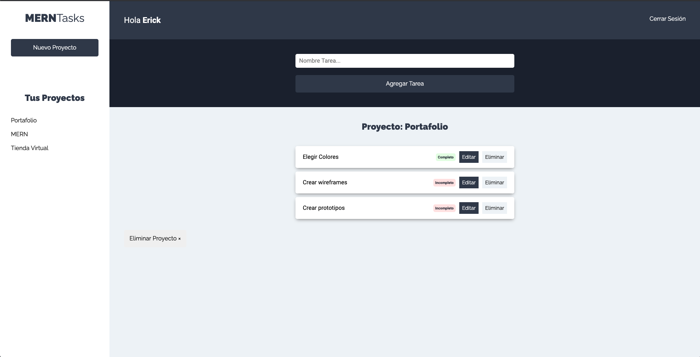

# 💻 MERNTasks (frontend)

MERNTasks es un proyecto para administrar tus proyectos y sus tareas, puedes darte de alta, crear nuevos proyectos y crear sus tareas, puedes editar y eliminar tareas además de cambiar su estado de incompleto a completo y viceversa.



## 🛠 Scripts

```bash
# Instalar dependencias
$ npm install

# Encender servidor de desarrollo en localhost:3000
$ npm start

# Crear version de producción
$ npm run build

```

## 💎 Tecnologías

- ReactJS
- React Hooks
- Bootstrap
- Axios

## 💣 Despliegue

https://admiring-einstein-2f682c.netlify.app/
